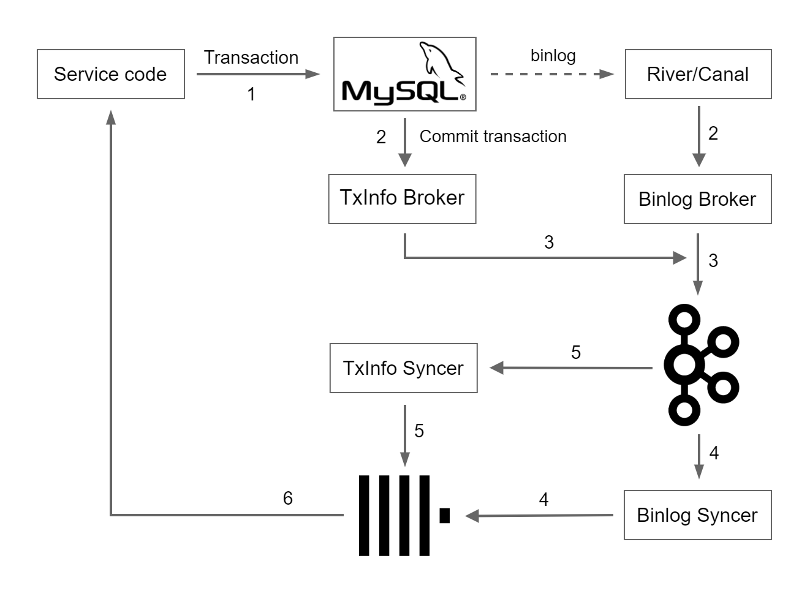

# Audit log

## 前置知识

MySQL binlog：[MySQL :: MySQL Internals Manual :: 20 The Binary Log](https://dev.mysql.com/doc/internals/en/binary-log.html)

GTID：[MySQL :: MySQL 5.6 Reference Manual :: 17.1.3.1 GTID Concepts](https://dev.mysql.com/doc/refman/5.6/en/replication-gtids-concepts.html)


## 架构



主要用到的组件有：

- River / Canal：消费 MySQL 的 binlog。组成 binlog_event steam。
- Binlog Broker：接收 binlog_event steam，进行数据清理，并将其写入 Kafka。
- TxInfo Broker：监听业务代码产生的事务信息（tx_info），并将其写入 Kafka。
- Kafka：主要用于存储 MySQL 的 binlog 以及业务代码产生的事务信息（tx_info）。有两个 topic，分别是 binlog 和 tx_info。
- Binlog Syncer：消费存入 Kafka 中的 binlog，将这些数据存入 ClickHouse。
- TxInfo Syncder：消费存入 Kafka 中的 tx_info，然后结合已经存入 ClickHouse 的 binlog_event，生成审计日志数据（audit_log）。存入 ClickHouse。
- ClickHouse：主要提供事务信息（tx_info）、MySQL 二进制文件（binlog）、审计日志数据（audit_log）的存储和查询。


## 原理

生成审计日志用到的主要方法是**异步监听 MySQL binlog 以及业务代码中对 MySQL 事务 GTID 作标记。**

主要流程如下：

1. 进行业务操作，完成 MySQL 事务提交。

2. 完成事务提交后，TxInfo Broker 会向 Kafka 中发送一条事务消息 tx_info，这个 tx_info 包含的数据有事务的 GTID、具体的操作类型（对应具体的业务操作）、该操作所对应的自定义上下文信息（Context）以及操作的时间 (tx_time)。于此同时 Binlog Broker 会消费 MySQL 的 binlog 并将其写入 Kafka 的 binlog Topic 中。

   ```go
   type TxInfo struct {
   	Time    int64  `db:"time" json:"time"`
   	Context string `db:"context" json:"context"`
   	GTID    string `db:"gtid" json:"gtid"`
   }
   ```

3. Binlog Syncer 会监听消费 Kafka 的 binlog Topic 中的数据，写入 ClickHouse。为之后生成最终的审计日志数据做一些数据准备；binlog_event 的数据为一个事务操作所涉及到的所有数据表发生变更的数据行，后续会通过 tx_info 的 GTID 在 binlog_event 中找出这个事务所影响到的所有数据生成最终的审计日志。

   ```go
   type BinlogEvent struct {
   	Db     string       `json:"db"`
   	Table  string       `json:"table"`
   	Action Action       `json:"action"`
   	GTID   string       `json:"gtid"`
   	Time   int64        `json:"time"`
   	Data   sql.RawBytes `json:"data"`
   }
   ```

4. TxInfo Syncer 会监听消费 Kafka 的 tx_info Topic。当 TxInfo Syncer 拿到一条 tx_info 消息后，会通过 GTID 查出所有的 binlog_event，生成最终的审计日志 audit_log，写入 ClickHouse。

5. 业务代码中查询 ClickHouse 的 audit_log 数据进行个性化处理。


## 使用

1. 初始化配置
2. 监听审计日志，执行自定义的操作函数
3. 执行 sql

```go
import (
	"fmt"
	"github.com/juju/errors"
	"github.com/obgnail/audit-log/audit_log"
	"github.com/obgnail/audit-log/context"
	"github.com/obgnail/audit-log/mysql"
	"github.com/obgnail/audit-log/mysql/utils/uuid"
	"github.com/obgnail/audit-log/types"
	"gopkg.in/gorp.v1"
	"time"
)

func main() {
	// 1. 初始化配置
	audit_log.Init("./config/config.toml")

	// 2. 监听审计日志, 执行自定义的操作函数
	audit_log.Run(audit_log.FunctionHandler(func(auditLog *types.AuditLog) error {
		fmt.Printf("get audit log: %+v\n", *auditLog)
		return nil
	}))

	time.Sleep(time.Second * 3)

	// 3. 执行sql
	insertUser()

	forever := make(chan struct{})
	<-forever
}

func insertUser() {
	// 每个具体业务对应一个Context。以【插入用户】为例
	// Context 中包含业务代码兴趣的环境信息
	insertUserContext := 1
	myContext := context.New(insertUserContext, "ContextParam1", "ContextParam2")

	// 执行MySQL事务,携带上面的Context
	err := mysql.DBMTransact(myContext.String(), func(tx *gorp.Transaction) error {
		_uuid := uuid.UUID()
		user := &User{_uuid, _uuid + "Name", _uuid + "@gmail.com", 0}
		sql := "INSERT INTO `user` (uuid, name, email, status) VALUES (?, ?, ?, ?);"
		args, _ := mysql.BuildSqlArgs(user.UUID, user.Name, user.Email, user.Status)
		if _, err := tx.Exec(sql, args...); err != nil {
			return errors.Trace(err)
		}
		return nil
	})
	checkErr(err)
}

// output:
// get audit log: {Time:2023-02-09 21:34:39 +0800 CST Context:1.ContextParam1.ContextParam2 GTID:577b1aef-a03e-11eb-b217-0242ac110003:248 BinlogEvents:[{Db:testdb01 Table:user Action:0 GTID:577b1aef-a03e-11eb-b217-0242ac110003:248 Data:{"before":{},"after":{"email":"2h1ooBWg@gmail.com","name":"2h1ooBWgName","status":0,"uuid":"2h1ooBWg"}}}]}
```


## Q&A 

Q：binlog_event 中的数据会越来越多，久而久之会不会带来非常大的存储开销？

A：binlog_event 中只存储近 30 天的数据，30 天前的数据会自动被删除。因为 binlog_event 中的数据只要被 TxInfo Syncer 使用后就已经失去了存储的意义，因为它永远不会再被任何场景用到。另外如果 binlog_event 如果过了 30 天还没被使用到，那么也可以判定这个数据永远不会再被用到了。

```sql
-- 在 ClickHouse 中 binlog_event 表的定义
CREATE TABLE binlog_event
(
    `db`     String,
    `table`  String,
    `action` Int32,
    `gtid`   String,
    `data`   String,
    `time`   DateTime DEFAULT now()
) ENGINE = MergeTree()
      PARTITION BY toYYYYMMDD(time) ORDER BY gtid
      TTL time + INTERVAL 30 DAY;
```

binlog_event 的数据不会被用到会有以下两种情况：

1. binlog_event 确实会存储一些永远不会被用到的数据。比如直接操作 MySQL 进行一些数据修改或新增，这时由于 MySQL 会产生 binlog，所以会生成 binlog_event 数据存储下来，但这个操作由于不是在业务系统中触发的，不会产生 tx_info，所以这个操作也不会被审计，自然存储在 binlog_event 中数据也永远不会用到。
2. TxInfo Syncer 服务不可用或消息消费出现了超过 30 天的延迟。无论服务不可用还是非常高的延迟都是不能接受的，当出现这类问题时应当及时定位修复，可以将这个 30 天视为我们故障的定位修复时间。


Q: TxInfo Syncer 是怎样通过 tx_info 的 GTID 来判断是否拿到了这个事务的完整的 binlog_event 的？

A: 主要有两种方式：

1. 会在 TxInfo Syncer 中定义一个 mapCtxBinlogEventCount，主要用来定义某个 Context 需要完整的 binlog_event 数目，这个数一般小于实际的数。通过 tx_info 的 Context 找出需要的数目，通过 tx_info 的 GTID 找出 binlog_event，当找到的数量大于或等于这个数时即可视为找到了完整的 binlog_event。
2. 如果某个 Context 没有在 mapCtxBinlogEventCount 中定义对应的数目，那么 TxInfo Syncer 会通过 GTID 每隔 100ms 查一次 binlog_event，连续查三次，如果三次查询的结果数目都是一样的，则可视为已经拿到了完整的 binlig_event，如果不一样就继续往复，直到三次结果都一样。


Q：TxInfo Syncer 通过 tx_info 的 GTID 没有及时查到需要的 binlog_event 会一直卡住吗？

A: 不会。因为 TxInfo Syncer 会通过 GTID 每隔 100ms 查一次 binlog_event，如果查询了 100 次（即 10s）仍然为 0，那么会将这个 tx_info 标记为未完成存入 ClickHouse 的 tx_info 表中，然后继续消费下一条 tx_info。TxInfo Syncer 会另外起一个 goroutine 每隔 10s 将过去 72 小时内未完成的 tx_info 重新进行消费。

